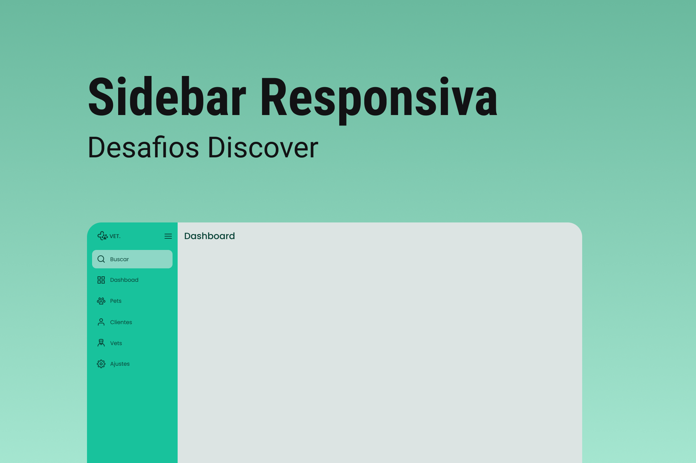

<h1 align="center">
  
</h1>

## Projeto

O projeto é a construção de uma sidebar (menu lateral).

### Requisitos para o desafio:

- Você deve criar uma sidebar que que altere o estado entre aberto e fechado conforme o clique do usuário.
- Você poderá usar como modelo o layout do Figma disponibilizado.

### Cores:

```css
:root {
  --body-bg-color: #dce4e3;
  --green: #18c29c;
  --light-green: #8ed7c6;
  --light-grey: #dce4e3;
  --text-color: #084236;
}
```

### Tipo de fonte:

- font-family: Poppins
- font-weight: 400 e 500
- Você pode encontrar a fonte no [Google Fonts](https://fonts.google.com/)

## Layout

- O layout do projeto encontra-se no [figma](https://www.figma.com/file/iOuqAlZvhAMkkfjCMFyc7Y/DD-%2F-Sidebar-Responsiva/duplicate)
